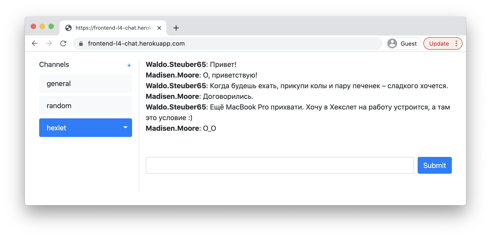
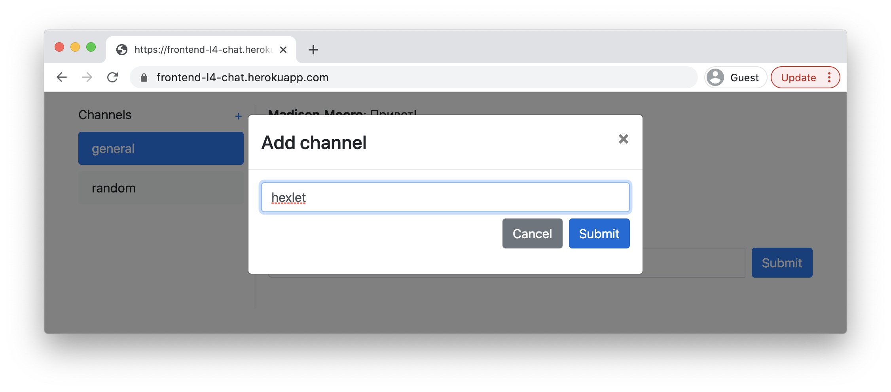

### Hexlet tests and linter status:

### GitHub CI

### Code Climate

## Hexlet Chat
A simple chat application (Slack Chat analog) with ability login/signup users, add channels and write messages.
## Install package
git clone https://github.com/A-Kimpo/frontend-bootcamp-project-12
cd frontend-bootcamp-project-12
npm ci
## Launch
make start
### [Test demo](https://frontend-bootcamp-project-12-production-bbc4.up.railway.app/)

